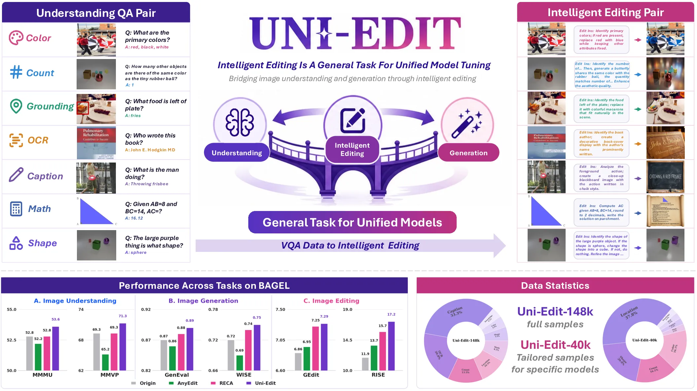

<p align="center">
  
</p>

<p align="center">
  <a href="https://zhengdian1.github.io/Uni-Edit-proj/">
    
  </a>
  <a href="assets/paper.pdf">
    
  </a>
  <a href="https://huggingface.co/Uni-Edit/Uni-Edit-BAGEL">
    
  </a>
  <a href="https://huggingface.co/datasets/Uni-Edit/Train-Data">
    
  </a>
</p>

# Uni-Edit: Intelligent Editing Is A General Task For Unified Model Tuning
> [Dian Zheng](https://zhengdian1.github.io/), [Manyuan Zhang](https://manyuan97.github.io), [Hongyu Li](https://scholar.google.com/citations?hl=zh-CN&user=PccL82sAAAAJ), [Hongbo Liu](https://github.com/Alexios-hub), [Kai Zou](https://github.com/Jacky-hate), [Kaituo Feng](https://tulerfeng.github.io/), [Hongsheng Li](https://www.ee.cuhk.edu.hk/~hsli/)<sup>+</sup>
>
> contact: zd1423606603@gmail.com
> 
> We introduce **Uni-Edit**, an intelligent image editing task that serves as the **first general task for Unified Multimodal Model (UMM) tuning**. Unlike conventional mixed multi-task training that suffers from inherent task conflicts and requires complex multi-stage pipelines, Uni-Edit breaks this paradigm. It achieves true mutual reinforcement by **improving image understanding, generation, and editing capabilities simultaneously using only one task, one training stage, and one dataset.**
> 
> To overcome the limitations of simplistic existing editing data, we propose the **first automated and scalable data synthesis pipeline** for intelligent editing. By transforming diverse VQA data into complex instructions with embedded questions and nested logic, we build **Uni-Edit-148k**, a dedicated dataset pairing reasoning-intensive instructions with high-quality edited images.
> 
> Extensive experiments on BAGEL and Janus-Pro demonstrate that tuning solely on Uni-Edit achieves **comprehensive enhancements across all three multimodal capabilities** without requiring any massive data mixing, balancing tricks, or auxiliary operations.

<p align="center"></p>

## 📢 News

- **May 21, 2026:** Releasing train, inference, eval code and models!

## 🔥 Quick Start

1️⃣  Set up environment
```bash
git clone https://github.com/zhengdian1/Uni-Edit.git
cd Uni-Edit
conda create -n uniedit python=3.10 -y
conda activate uniedit
pip install -r requirements.txt
pip install flash_attn==2.5.8 --no-build-isolation
```

2️⃣  Download pretrained checkpoint
```python
from huggingface_hub import snapshot_download

save_dir = "your/path/to/Uni-Edit-BAGEL"
repo_id = "Uni-Edit/Uni-Edit-BAGEL"
cache_dir = save_dir + "/cache"

snapshot_download(cache_dir=cache_dir,
  local_dir=save_dir,
  repo_id=repo_id,
  local_dir_use_symlinks=False,
  resume_download=True,
  allow_patterns=["*.json", "*.safetensors", "*.bin", "*.py", "*.md", "*.txt"],
)

```

**⚠️ IMPORTANT: Custom Architecture**
Because this is a custom architecture, you **CANNOT** load it directly via `AutoModel.from_pretrained()`. To run the provided inference code, you **MUST** physically merge these shards into a single `ema.safetensors` file on your local machine.

Run the following Python script in the directory where you downloaded the repository. 
*(Note: You need at least 54GB of free system RAM to perform this merge).*

```bash
python merge.py --model_path your/path/to/Uni-Edit-BAGEL
```

3️⃣ Quick infer with Uni-Edit with task type `gen`, `und`, `edit`!
```bash
python infer.py --task edit
```

## 🔥 Train & Eval

### Train

```bash
bash train.sh
```

You can replace the variables in the script with your own before running. 
See [TRAIN](https://github.com/ByteDance-Seed/Bagel/blob/main/TRAIN.md) for more details.

### Eval

```bash
bash scripts/eval/run_geneval.sh
bash scripts/eval/run_wise.sh
bash scripts/eval/run_eval_vlm.sh
bash scripts/eval/run_imgedit.sh
bash scripts/eval/run_gedit.sh
bash scripts/eval/run_rise.sh
```

We provide the scripts for evaluating VLM, T2I and Editing benchmarks. 
See [EVAL](https://github.com/ByteDance-Seed/Bagel/blob/main/EVAL.md) for more details.

## 🔥 Data Construction Pipeline

We provide the scripts for our full data construction pipeline. 
See [DATA](https://github.com/zhengdian1/Uni-Edit/tree/main/data_gen/README.md) for more details. 

## ✍️ Citation

```bibtex
@article{zheng2026uniedit,
  title   = {Uni-Edit: Intelligent Editing Is A General Task For Unified Model Tuning},
  author  = {Zheng, Dian and Zhang, Manyuan and Li, Hongyu and Liu, Hongbo and Zou, Kai and Feng, Kaituo and Li, Hongsheng},
  journal = {},
  year    = {2026}
}
```

## 📜 License
Uni-Edit is licensed under the Apache 2.0.
